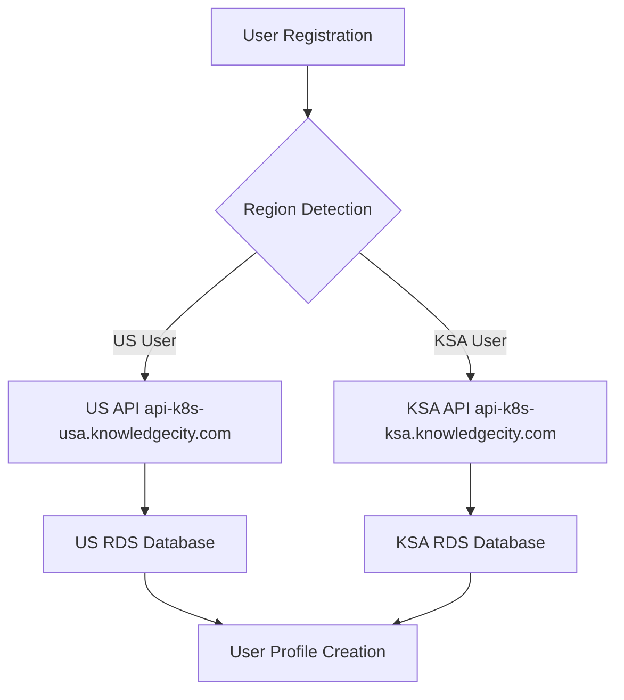
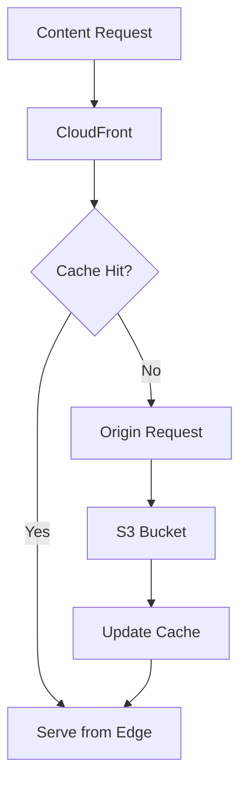
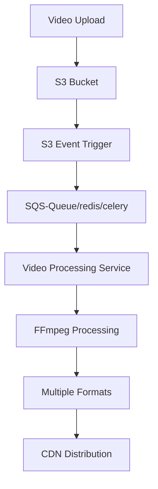

# KnowledgeCity Platform Architecture - DevOps 

## Overview

KnowledgeCity is a globally distributed educational platform designed to serve users in multiple regions with minimal latency while ensuring data residency compliance. The architecture follows a hybrid approach combining global content delivery with regional data processing.


## What This Project Demonstrates

### Infrastructure Architecture
- Multi-region AWS deployment (US East & Middle East)
- Regional data isolation and compliance
- High availability (99.99% SLA) design
- Auto-scaling and disaster recovery

### DevOps Practices
- Infrastructure as Code with AWS CDK
- Container orchestration with EKS
- CI/CD pipeline design
- Monitoring and observability with Prometheus/CloudWatch

### Security & Compliance
- Data residency compliance (US/KSA regions)
- Network security with VPC, WAF, and security groups
- Encryption at rest and in transit
- RBAC and secrets management

## 🚀 Key Technologies

- **Cloud**: AWS (Multi-region)
- **Orchestration**: Kubernetes (EKS)
- **IaC**: AWS CDK
- **Monitoring**: Prometheus, CloudWatch, ELK Stack
- **Security**: WAF, KMS, Secrets Manager
- **CDN**: CloudFront with 200+ edge locations

## 📋 Important Note

**This is purely an infrastructure and DevOps demonstration.** No actual applications (frontend/backend) have been developed as they are outside the scope of this assignment. The focus is on showcasing enterprise-level infrastructure design and DevOps best practices.

## Core Principles

### 1. Regional Data Isolation
- **US Users**: All personal data stored and processed in US East (us-east-1)
- **KSA Users**: All personal data stored and processed in Middle East (me-south-1)
- **Global Content**: Educational courses available worldwide via CDN

### 2. High Availability (99.99% SLA)
- Multi-Availability Zone deployment in each region
- Auto-failover capabilities
- Redundant infrastructure components
- Health monitoring and automatic recovery

### 3. Scalability
- Horizontal auto-scaling for all components
- Microservices architecture for independent scaling
- Container orchestration with Kubernetes
- Event-driven architecture for loose coupling

## Infrastructure Components

### Global Layer

#### CloudFront CDN
```yaml
Purpose: Global content delivery
Components:
  - Static assets (JS, CSS, images)
  - Educational video content
  - API response caching
Features:
  - 200+ edge locations worldwide
  - Automatic compression
  - HTTP/2 and HTTP/3 support
  - Real-time metrics
```

#### Route 53
```yaml
Purpose: DNS management and routing
Features:
  - Geolocation-based routing
  - Health checks
  - Failover routing
  - Latency-based routing
```

### Regional Infrastructure

#### Compute Layer (EKS)
```yaml
EKS Cluster Configuration:
  Node Groups:
    - General Purpose: m5.large (2-10 nodes)
    - Compute Optimized: c5.xlarge (1-5 nodes)
    - Memory Optimized: r5.large (1-3 nodes)
  
  Networking:
    - VPC with public/private subnets
    - NAT Gateways in each AZ
    - Internet Gateway
    - VPC Endpoints for AWS services
  
  Security:
    - Pod Security Standards
    - Network Policies
    - RBAC configuration
    - Service Accounts with IAM roles
```

#### Data Layer (RDS)
```yaml
RDS Aurora Configuration:
  Engine: Postgress Aurora & Mysql  # Its your choice
  Deployment:
    - Primary instance in AZ-1a
    - Read replica in AZ-1b
    - Cross-region backup replica
  
  Performance:
    - Instance class: t3.medium
    - Storage: Encrypted at rest
    - Backup retention: 7 days
    - Performance Insights enabled
```

#### Storage Layer
```yaml
S3 Buckets:
  - Frontend assets (globally replicated)
  - Video content (multi-region)
  - User uploads (region-specific)
  - Database backups (encrypted)
  
Storage Classes:
  - Frequent access: S3 Standard
  - Infrequent access: S3 IA
  - Archive: S3 Glacier
  - Long-term archive: S3 Deep Archive
```

## Microservices Architecture

### 1. PHP Monolith API
```yaml
Purpose: Core business logic
Technologies:
  - PHP 8.2 with Laravel framework
  - Redis for caching and sessions
  - Elasticsearch for search
  
Scaling:
  - Horizontal Pod Autoscaler (HPA)
  - Target: 70% CPU utilization
  - Min replicas: 3
  - Max replicas: 20
```

### 2. Analytics Microservice
```yaml
Purpose: User interaction analysis
Technologies:
  - ClickHouse database
  - Apache Kafka for event streaming
  - Python with FastAPI
  
Data Pipeline:
  - Real-time event ingestion
  - Batch processing with Apache Spark
  - Machine learning models for recommendations
```

### 3. Video Processing Microservice
```yaml
Purpose: Video conversion and optimization
Technologies:
  - FFmpeg for video processing
  - AWS Batch for job processing
  - S3 for video storage
  
Workflow:
  - Upload trigger via S3 events
  - Queue processing with SQS
  - Multiple format generation
  - CDN cache invalidation
```

## Security Architecture

### Network Security
```yaml
VPC Security:
  - Private subnets for databases
  - Public subnets for load balancers
  - NACLs for subnet-level security
  - Security groups for instance-level security

WAF Rules:
  - SQL injection protection
  - XSS protection
  - Rate limiting
  - Geo-blocking for restricted regions
```

### Application Security
```yaml
Authentication:
  - JWT tokens with refresh mechanism
  - Multi-factor authentication
  - OAuth 2.0 integration
  - Session management

Authorization:
  - Role-based access control (RBAC)
  - Attribute-based access control (ABAC)
  - Resource-level permissions
  - API rate limiting
```

### Data Security
```yaml
Encryption:
  - TLS 1.3 for data in transit
  - AES-256 for data at rest
  - KMS key management
  - Certificate management with ACM

Secrets Management:
  - AWS Secrets Manager
  - Kubernetes secrets
  - Rotation policies
  - Audit logging
```

## Data Flow Architecture

### User Registration Flow


### Content Delivery Flow


### Video Processing Flow


## Monitoring and Observability

### Metrics Collection
```yaml
Prometheus:
  - Kubernetes cluster metrics
  - Application metrics
  - Custom business metrics
  - Alert rules and notifications

CloudWatch:
  - AWS service metrics
  - Custom application metrics
  - Log aggregation
  - Dashboards and alarms
```

### Logging Strategy
```yaml
Application Logs:
  - Structured JSON logging
  - Correlation IDs for tracing
  - Log levels: ERROR, WARN, INFO, DEBUG
  - Centralized logging with ELK stack

Audit Logs:
  - User authentication events
  - Data access logs
  - Administrative actions
  - Compliance reporting
```

## Disaster Recovery

### Backup Strategy
```yaml
Database Backups:
  - Automated daily backups
  - Point-in-time recovery
  - Cross-region backup copies
  - Backup encryption

Application Backups:
  - Infrastructure as Code (CDK)
  - Container image in ECR
  - Configuration backups
  - Secrets backup
```

### Recovery Procedures
```yaml
RTO (Recovery Time Objective): 4 hours
RPO (Recovery Point Objective): 1 hour

Failover Process:
  1. Automated health checks
  2. DNS failover to backup region
  3. Database promotion
  4. Application deployment
  5. Data synchronization
```

## Performance Optimization

### Caching Strategy
```yaml
CDN Caching:
  - Static assets: 1 year TTL
  - Dynamic content: 5 minutes TTL
  - API responses: 1 minute TTL
  - Video content: 1 week TTL

Application Caching:
  - Redis for session storage
  - Database query caching
  - Object caching
  - Full-page caching
```

### Database Optimization
```yaml
Query Optimization:
  - Index optimization
  - Query plan analysis
  - Connection pooling
  - Read replica utilization

Performance Monitoring:
  - Slow query detection
  - Performance Insights
  - Connection monitoring
  - Resource utilization tracking
```

## Cost Optimization

### Reserved Capacity
- RDS Reserved Instances for 1-3 years
- EC2 Reserved Instances for predictable workloads
- CloudFront Reserved Capacity

### Spot Instances
- Batch processing workloads
- Development environments
- Non-critical background tasks

### Storage Optimization
- S3 Intelligent Tiering
- Lifecycle policies for log retention
- Data compression and deduplication

This architecture provides a robust, scalable, and secure foundation for the KnowledgeCity educational platform while maintaining compliance with regional data requirements and achieving the target 99.99% SLA.

